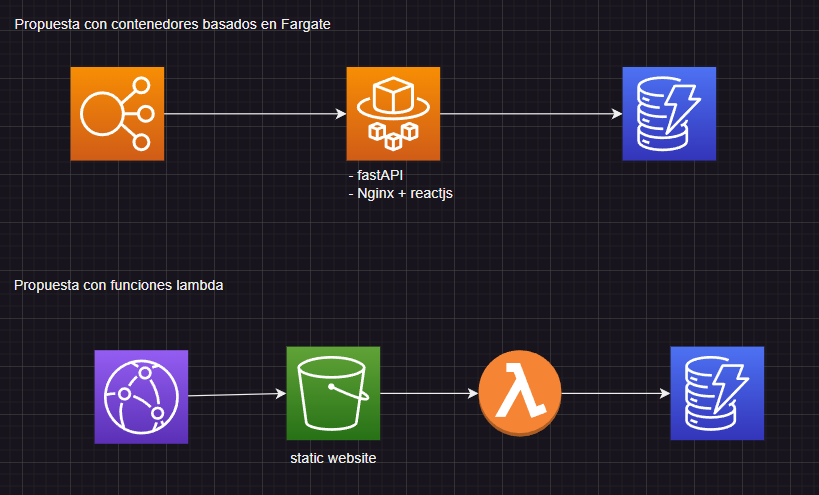

# Generalidades

Evidentemente este proyecto se puede realizar de infinitas maneras diferentes. Decidí utilizar las siguientes herramientas

- fastapi
- reactjs
- ECS
- dynamoDB
- AWS CDK y CloudFormation tras bambalinas

> Las imágenes tanto del backend como el frontend fueron subidas a [docker.hub](https://hub.docker.com/repository/docker/jhonsanz/amaris-prueba/general)

# Consideraciones del backend con fastApi

Debido a la utilización de fastApi se incurre en gastos de utilización de los servicios de cloud computing de AWS como EC2 o Fargate. Si bien para este proyecto utilizar fastApi **es como matar una mosca con una escopeta**, decidí hacerlo así para mostrar un poco de mi manejo de contenedores, ya que el objetivo de la prueba es evaluar mis habilidades desarrollo.

Como se mencionó al inicio, es claro que el backend se puede realizar con **funciones lambda**, pero la descripción de la prueba me daba cierta libertad en el uso de las herramientas, y las restricciones eran **python y serverless**. Teniendo en cuenta que Fargate hace parte de la categoría serverless de AWS, la construcción de la api con contenedores cumple con este requerimiento. De todos modos, el hacerlo con funciones lambda es muy similar, ya que esto realmente se trata de comunicarnos a dynamoDB con python.

# Arquitectura


Si bien era totalmente posible desplegar el frontend en un bucket S3 como un sitio web estático, aproveché el uso de contenedores para automatizar el endpoint del backend como se discutirá mas adelante a profundidad. El aprovechamiento de los servicios detrás del balanceador de carga permite comunicar la ambas backend y frotnend auqnue estén en contenedores diferentes.

Con las funciones lambda el trabajo sería muy similar. Sin embargo fastApi (y en general los frameworks backend) ya cuentan con funcionalidades para facilitarnos la vida, pero se complica el despliegue... unas por otras.

# Billing

Fargate clasifica como serverless ya que **no debemos preocuparnos** por el mantenimiento ni la gestion de una instancia EC2, fargate hace todo automáticamente _behind the sceens_, pero esto no significa que Fargate no cobre 24/7. A diferencia de Lambda, Fargate siempre está encendido y comparativamente es una desventaja en cuanto a precios

Lambda es sin duda la mejor alternativa para este ejercicio ya que el cobro se hace por llamados, igualmente la facilidad de implementación y despliegue.

# Database schema

Para gestionar el almacenamiento en dynamoDB, decidí crear 3 tablas separadas, las cuales se ven de la siguiente manera:

1. amaris-users
```json
[
    {
        "userId": "user_001",
        "money": 425000,
        "name": "Cliente feliz",
        "subscriptions": []
    }
]
```
2. amaris-transaction
```json
[
    {
        "transactionId": "trans_001",
        "userId": "user_001",
        "fundId": "1",
        "amount": "500000",
        "type": "subscription",
        "timestamp": "2024-10-09T12:00:00Z",
    }
]
```
3. amaris-fund
```json
[
    {
        "fundId": "1",
        "amount": 75000,
        "category": "FPV",
        "name": "FPV_EL CLIENTE_RECAUDADORA"
    },
    {
        "fundId": "2",
        "amount": 125000,
        "category": "FPV",
        "name": "FPV_EL CLIENTE_ECOPETROL"
    },
    {
        "fundId": "3",
        "amount": 50000,
        "category": "FIC",
        "name": "DEUDAPRIVADA"
    },
    {
        "fundId": "4",
        "amount": 250000,
        "category": "FIC",
        "name": "FDO-ACCIONES"
    },
    {
        "fundId": "5",
        "amount": 100000,
        "category": "FPV",
        "name": "FPV_EL CLIENTE_DINAMICA"
    }
]
```

de esta manera la aplicación puede funcionar para varios usuarios, sin embargo, debido a los requerimientos explícitos del documento, solo hay un usuario jeje

# Iac

Esta sección es controversial y la hice mas o menos _ad libitum_. Si bien el documento dice explícitamente utilizar CloudFormation, tuve dificultades para hacerlo from scratch y decidí utilizar la librería AWS CDK. Entiendo que me salí del alcance del proyecto pero para mi defensa puedo decir que esta librería convierte el código de python a CloudFormation con `cdk synth`, entonces de alguna manera se cumple el requerimiento. Puede revisarse en `iac/output.yml`

# How to run this project?

Finalmente y después de tanta palabrería........

Para ejecutar esto:

0. Tener instalado `aws cli`
1. Tener configurado `aws config`
2. Entrar al directorio `/iac`
3. Activar el entorno virtual `.venv\Scripts\activate` o `.venv/bin/activate`
4. Ejecutar `pip install -r requirements.txt`
5. Ejectuar `cdk bootstrap`
6. Opcional `cdk synth` para ver la plantilla de cloud formation
7. Ejectuar `cdk deploy` para desplegar el contenido
8. Disfrutar
9. Recomendado `cdk destroy` para eliminar el stack


Esto debería

1. Crear todos los recursos en AWS
2. Los contenedores deberían dar el healthcheck, y ejecutarse automáticamente seed.py el cual creará los datos iniciales en las tablas de dyanamoDB

### 👇🚨🚨⚠️⚠️ IMPORTANTE ⚠️⚠️🚨🚨👇

> **Para acceder a la aplicación** lo debemos hacer mediante el balanceador de carga. Entonces hay que buscar el balanceador en EC2 y copiar el DNS en una pestaña del navegador
